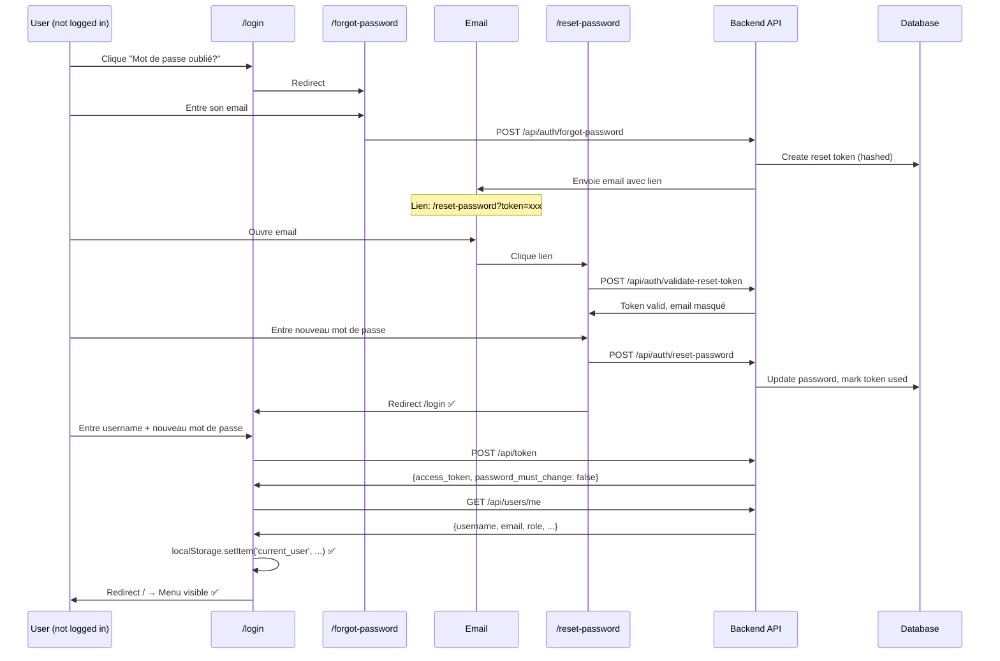
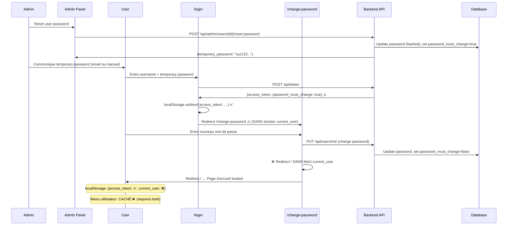

# Scope du Bug - Flux Affectés vs Non-Affectés

## ⚠️ IMPORTANT : Seul 1 des 2 Flux de Reset Password Est Bugué

PCAP Analyzer a **DEUX** flux distincts pour réinitialiser un mot de passe :

1. ✅ **Self-Service Password Reset** (Forgot Password) - **FONCTIONNE CORRECTEMENT**
2. ❌ **Admin-Initiated Password Reset** (Forced Password Change) - **BUGUÉ** ← Ce track corrige CELUI-CI

---

## ✅ Flux 1 : Self-Service (Fonctionne - Pas de Bug)

### Description

L'utilisateur a **oublié** son mot de passe et demande un reset via le formulaire "Mot de passe oublié".

### Séquence Complète



### Pourquoi Ça Fonctionne

**Redirection vers `/login`** après reset (reset-password.html:286):
```javascript
if (response.ok) {
    window.toast.success('Mot de passe réinitialisé !', 3000);
    setTimeout(() => {
        window.location.href = '/login';  // ← Re-login forcé
    }, 2000);
}
```

**Re-login complet** → Flux de login normal s'exécute:
- Fetch `/api/users/me` (login.html:205)
- Store `current_user` (login.html:213)
- Redirect `/` → Menu visible ✅

**Fichiers concernés**:
- `app/templates/forgot-password.html`
- `app/templates/reset-password.html`
- `app/api/routes/auth.py` (endpoints: `/forgot-password`, `/reset-password`, `/validate-reset-token`)

---

## ❌ Flux 2 : Admin Reset (BUGUÉ - Ce Track Corrige Ça)

### Description

Un administrateur réinitialise le mot de passe d'un utilisateur. L'utilisateur reçoit un mot de passe **temporaire** et doit le changer à la première connexion.

### Séquence Complète



### Pourquoi C'est Bugué

**Lors du login avec `password_must_change=true`** (login.html:190-201):
```javascript
if (data.password_must_change === true) {
    // ❌ Redirection IMMÉDIATE sans fetch/store current_user
    window.location.href = '/change-password';
    return;  // ← Exit précoce, code ci-dessous jamais exécuté
}

// ✅ Ce code n'est JAMAIS atteint si password_must_change=true
const userResponse = await fetch('/api/users/me', ...);
const user = await userResponse.json();
localStorage.setItem('current_user', JSON.stringify(user));
```

**Après changement de mot de passe** (change-password.html:213-219):
```javascript
if (response.ok) {
    window.toast.success('✅ Mot de passe changé avec succès! Redirection...');

    // ❌ Redirection DIRECTE sans fetch current_user
    setTimeout(() => {
        window.location.href = '/';  // ← User déjà logged in (token présent)
    }, 2000);
}
```

**État du localStorage après redirection**:
```javascript
{
    "access_token": "eyJhbG...",  // ✅ Présent (depuis login.html:186)
    "token_type": "bearer",       // ✅ Présent
    "current_user": undefined      // ❌ JAMAIS STOCKÉ → BUG
}
```

**Vérification du menu** (common.js:467):
```javascript
const token = localStorage.getItem('access_token');         // ✅ Présent
const currentUserData = localStorage.getItem('current_user'); // ❌ null

if (token && currentUserData) {  // ← Condition échoue
    userMenu.classList.remove('hidden');  // ← Jamais exécuté
}
// Menu reste caché ❌
```

**Fichiers concernés**:
- `app/templates/login.html` (lignes 190-201)
- `app/templates/change-password.html` (lignes 213-219) ← **FICHIER À CORRIGER**
- `app/static/js/common.js` (lignes 455-518 - initializeUserMenu)
- `app/api/routes/auth.py` (endpoints: `PUT /users/me`, `POST /admin/users/{id}/reset-password`)

---

## 🎯 Solution Proposée (Admin Reset Uniquement)

**Fichier à modifier**: `app/templates/change-password.html`
**Lignes**: 213-219

**Changement**:
```javascript
if (response.ok) {
    window.toast.success('✅ Mot de passe changé avec succès! Redirection...');

    // 🔧 FIX: Fetch user data AVANT redirection
    const token = localStorage.getItem('access_token');
    try {
        const userResponse = await fetch('/api/users/me', {
            headers: {'Authorization': `Bearer ${token}`}
        });

        if (userResponse.ok) {
            const user = await userResponse.json();
            localStorage.setItem('current_user', JSON.stringify(user)); // ✅ Store

            if (window.csrfManager) {
                await window.csrfManager.init();
            }
        }
    } catch (error) {
        console.error('Error fetching user data:', error);
        // Continue anyway - graceful fallback
    }

    setTimeout(() => {
        window.location.href = '/';  // Redirect avec current_user stocké ✅
    }, 2000);
}
```

**Pattern**: Identique au login normal (login.html:205-226)

---

## 📝 Tests Requis

### 1. Test du Fix (Admin Reset)

**Objectif**: Vérifier que le bug est corrigé

**Assertions**:
- ✅ Menu utilisateur visible après changement de mot de passe forcé
- ✅ Logout fonctionnel
- ✅ `localStorage.current_user` présent

### 2. Test de Non-Régression (Self-Service)

**Objectif**: Vérifier que le self-service n'est PAS cassé par le fix

**Assertions**:
- ✅ Redirection vers `/login` après reset (pas vers `/`)
- ✅ Menu visible après re-login
- ✅ Logout fonctionnel

---

## 🔍 Résumé Visuel

| Critère | Self-Service | Admin Reset (AVANT fix) | Admin Reset (APRÈS fix) |
|---------|--------------|------------------------|------------------------|
| **User logged in après reset?** | ❌ Non (doit re-login) | ✅ Oui (token présent) | ✅ Oui (token présent) |
| **Redirect après reset** | `/login` | `/` | `/` |
| **`current_user` stocké?** | ✅ Oui (au login) | ❌ Non (BUG) | ✅ Oui (fix) |
| **Menu utilisateur visible?** | ✅ Oui | ❌ Non (BUG) | ✅ Oui (fix) |
| **Logout fonctionnel?** | ✅ Oui | ❌ Non (pas de bouton) | ✅ Oui (fix) |
| **UX** | Re-login requis (acceptable) | Meilleure (pas de re-login) | Meilleure (pas de re-login) |

---

## ✅ Conclusion

**Ce track corrige UNIQUEMENT le flux admin reset** (`change-password.html`).

**Le flux self-service fonctionne déjà** (`reset-password.html`) et ne nécessite AUCUNE modification.

**Tests de non-régression** requis pour s'assurer que le fix n'affecte pas le self-service.
